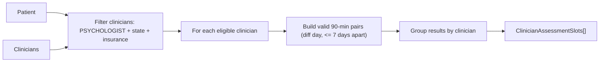

# Task 1: Assessment Slots

## Overview

Given a `Patient`, return available assessment slot pairs (two 90-min sessions on
different days, no more than 7 days apart) grouped by eligible psychologist,
filtered by the patient's state and insurance, and built to scale to hundreds of
clinicians.

## Goal

Given a `Patient`, return the assessment slot options they can book, grouped by clinician. An assessment = **two** 90-minute sessions that are on **different days** and **<= 7 days apart**, so each option is a *pair* of slots. Only psychologists who operate in the patient's `state` and accept their `insurance` are eligible.

## Scope

- In scope: eligibility filtering, pair generation, grouping by clinician, demo entrypoint, mock data.
- Out of scope (later tasks): slot-overlap optimization (Task 2), daily/weekly capacity + existing appointments (Task 3). Code will be structured so these layer in without rewrites.

## Data flow




## Eligibility rules (a clinician qualifies if all hold)

- `clinicianType === "PSYCHOLOGIST"` (assessments are psychologist-only).
- `clinician.states` includes `patient.state`.
- `clinician.insurances` includes `patient.insurance`.

Filtering happens first, before any pairing work, so the O(n^2)-per-clinician pairing only runs on the small matched subset (keeps it viable for hundreds of clinicians).

## Pairing rules

- Only 90-minute slots are paired (assessment sessions).
- A valid pair `(a, b)` requires: different UTC calendar days, and `1 <= daysApart <= 7`.
- `daysApart` is computed by normalizing each slot's `date` to its UTC midnight and diffing in whole days. Verified against the README example: `08-21 -> 08-28` (= 7) is valid, `08-19 -> 08-28` (= 9) is not.
- Pairs are ordered earliest-first and de-duplicated (only `i < j` combinations), matching the README's expected 11 pairs from the 6-slot sample.

## Planned implementation

### `src/scheduling/types.ts`

```ts
export interface AssessmentSessionSlot {
  date: string; // ISO-8601 UTC start time
  length: number; // minutes (90 for assessments)
}

export interface AssessmentSlotPair {
  session1: AssessmentSessionSlot;
  session2: AssessmentSessionSlot;
}

export interface ClinicianAssessmentSlots {
  clinician: {
    id: string;
    firstName: string;
    lastName: string;
  };
  pairs: AssessmentSlotPair[];
}
```

### `src/scheduling/dateKeys.ts`

```ts
export const MS_PER_DAY = 24 * 60 * 60 * 1000;

// Canonical UTC day bucket: 12:00 and 15:00 on the same date map to the same
// value, and day diffs come out as whole numbers. Returns epoch time in
// milliseconds at 00:00:00.000 UTC of that day.
export function utcDayKey(date: Date): number {
  return Date.UTC(date.getUTCFullYear(), date.getUTCMonth(), date.getUTCDate());
}
```

### `src/scheduling/assessmentSlots.ts`

```ts
import { AvailableAppointmentSlot } from "../starter-code/appointment";
import { Clinician } from "../starter-code/clinician";
import { Patient } from "../starter-code/patient";
import { MS_PER_DAY, utcDayKey } from "./dateKeys";
import { AssessmentSlotPair, ClinicianAssessmentSlots } from "./types";

export const ASSESSMENT_SESSION_MINUTES = 90;
export const ASSESSMENT_MIN_DAYS_APART = 1;
export const ASSESSMENT_MAX_DAYS_APART = 7;

export function isEligibleForAssessment(
  patient: Patient,
  clinician: Clinician,
): boolean {
  return (
    clinician.clinicianType === "PSYCHOLOGIST" &&
    clinician.states.includes(patient.state) &&
    clinician.insurances.includes(patient.insurance)
  );
}

export function buildAssessmentPairs(
  slots: AvailableAppointmentSlot[],
): AssessmentSlotPair[] {
  // Keep only assessment-length slots, sorted earliest-to-latest so we can pair
  // earlier with later and rely on that order for the early-exit below.
  const assessmentSlots = slots
    .filter((slot) => slot.length === ASSESSMENT_SESSION_MINUTES)
    .sort((a, b) => a.date.getTime() - b.date.getTime());

  const pairs: AssessmentSlotPair[] = [];

  // Consider every ordered pair (i < j) once so each option appears a single time.
  for (let i = 0; i < assessmentSlots.length; i++) {
    const first = assessmentSlots[i];
    // `first` is fixed for the inner loop, so compute its day once.
    const firstDayKey = utcDayKey(first.date);

    for (let j = i + 1; j < assessmentSlots.length; j++) {
      const second = assessmentSlots[j];
      const gap = Math.round(
        (utcDayKey(second.date) - firstDayKey) / MS_PER_DAY,
      );

      // Sorted earliest-to-latest, so once the gap is too large every later
      // slot is further still -> stop scanning the rest for this `first`.
      if (gap > ASSESSMENT_MAX_DAYS_APART) break;
      // Same-day (or otherwise too-close) pairs aren't valid assessments.
      if (gap < ASSESSMENT_MIN_DAYS_APART) continue;

      pairs.push({
        session1: { date: first.date.toISOString(), length: first.length },
        session2: { date: second.date.toISOString(), length: second.length },
      });
    }
  }

  return pairs;
}

export function getAssessmentSlotsForPatient(
  patient: Patient,
  clinicians: Clinician[],
): ClinicianAssessmentSlots[] {
  return clinicians
    .filter((clinician) => isEligibleForAssessment(patient, clinician))
    .map((clinician) => ({
      clinician: {
        id: clinician.id,
        firstName: clinician.firstName,
        lastName: clinician.lastName,
      },
      pairs: buildAssessmentPairs(clinician.availableSlots),
    }))
    .filter((result) => result.pairs.length > 0);
}
```

## Verification

A unit test pins down the pairing rule; an end-to-end test confirms `getAssessmentSlotsForPatient` filters eligibility and groups by clinician.

### `src/scheduling/assessmentSlots.test.ts`

```ts
import { AvailableAppointmentSlot } from "../starter-code/appointment";
import { buildAssessmentPairs } from "./assessmentSlots";

const sampleSlots: AvailableAppointmentSlot[] = [
  "2024-08-19T12:00:00.000Z",
  "2024-08-19T12:15:00.000Z",
  "2024-08-21T12:00:00.000Z",
  "2024-08-21T15:00:00.000Z",
  "2024-08-22T15:00:00.000Z",
  "2024-08-28T12:15:00.000Z",
].map((date, index) => ({
  id: `s${index}`,
  clinicianId: "c1",
  date: new Date(date),
  length: 90,
  createdAt: new Date(),
  updatedAt: new Date(),
}));

test("buildAssessmentPairs: pairs sessions on different days within seven days of each other", () => {
  const tuples = buildAssessmentPairs(sampleSlots).map((p) => [
    p.session1.date,
    p.session2.date,
  ]);

  expect(tuples).toEqual([
    ["2024-08-19T12:00:00.000Z", "2024-08-21T12:00:00.000Z"],
    ["2024-08-19T12:00:00.000Z", "2024-08-21T15:00:00.000Z"],
    ["2024-08-19T12:00:00.000Z", "2024-08-22T15:00:00.000Z"],
    ["2024-08-19T12:15:00.000Z", "2024-08-21T12:00:00.000Z"],
    ["2024-08-19T12:15:00.000Z", "2024-08-21T15:00:00.000Z"],
    ["2024-08-19T12:15:00.000Z", "2024-08-22T15:00:00.000Z"],
    ["2024-08-21T12:00:00.000Z", "2024-08-22T15:00:00.000Z"],
    ["2024-08-21T12:00:00.000Z", "2024-08-28T12:15:00.000Z"],
    ["2024-08-21T15:00:00.000Z", "2024-08-22T15:00:00.000Z"],
    ["2024-08-21T15:00:00.000Z", "2024-08-28T12:15:00.000Z"],
    ["2024-08-22T15:00:00.000Z", "2024-08-28T12:15:00.000Z"],
  ]);
});
```

### `src/scheduling/getAssessmentSlotsForPatient.test.ts`

```ts
import { getAssessmentSlotsForPatient } from "./assessmentSlots";
import { AvailableAppointmentSlot } from "../starter-code/appointment";
import { Clinician } from "../starter-code/clinician";
import { Patient } from "../starter-code/patient";

const patient: Patient = {
  id: "patient",
  firstName: "Pat",
  lastName: "Ient",
  state: "NY",
  insurance: "AETNA",
  createdAt: new Date(),
  updatedAt: new Date(),
};

function slot(clinicianId: string, date: string): AvailableAppointmentSlot {
  return {
    id: `${clinicianId}-${date}`,
    clinicianId,
    date: new Date(date),
    length: 90,
    createdAt: new Date(),
    updatedAt: new Date(),
  };
}

// A clinician defaulting to an eligible (NY / AETNA) psychologist; override per test.
function clinician(overrides: Partial<Clinician> & { id: string }): Clinician {
  return {
    firstName: "Doc",
    lastName: "Tor",
    states: ["NY"],
    insurances: ["AETNA"],
    clinicianType: "PSYCHOLOGIST",
    appointments: [],
    availableSlots: [],
    maxDailyAppointments: 10,
    maxWeeklyAppointments: 10,
    createdAt: new Date(),
    updatedAt: new Date(),
    ...overrides,
  };
}

test("getAssessmentSlotsForPatient: returns options only for eligible clinicians, grouped by clinician", () => {
  const eligible = clinician({
    id: "eligible",
    availableSlots: [
      slot("eligible", "2024-08-19T12:00:00.000Z"),
      slot("eligible", "2024-08-21T12:00:00.000Z"),
    ],
  });
  const wrongState = clinician({
    id: "wrong-state",
    states: ["CA"],
    availableSlots: [slot("wrong-state", "2024-08-19T12:00:00.000Z")],
  });
  const therapist = clinician({
    id: "therapist",
    clinicianType: "THERAPIST",
    availableSlots: [slot("therapist", "2024-08-19T12:00:00.000Z")],
  });

  const results = getAssessmentSlotsForPatient(patient, [
    eligible,
    wrongState,
    therapist,
  ]);

  expect(results).toHaveLength(1);
  expect(results[0].clinician.id).toBe("eligible");
  expect(results[0].pairs).toEqual([
    {
      session1: { date: "2024-08-19T12:00:00.000Z", length: 90 },
      session2: { date: "2024-08-21T12:00:00.000Z", length: 90 },
    },
  ]);
});
```

The `slot` / `clinician` factory helpers are reused by the Task 2 and Task 3 end-to-end tests.