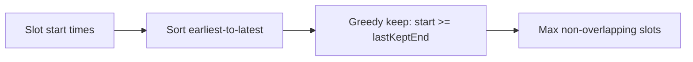
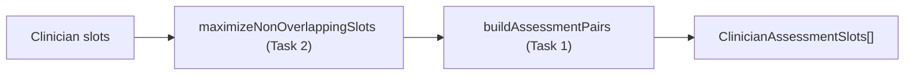

# Task 2: Optimizing Which Slots We Show

## Overview

Given a list of slot start times and an appointment duration (e.g. 90 minutes),
filter the list down to the subset that **maximizes the number of appointments
that can still be booked** that day. Overlapping 15-minute-interval slots collapse
to the fewest, best-spaced options, and this optimization plugs into the Task 1
pipeline.

## Goal

When slots are offered at fine intervals (e.g. every 15 minutes from 12:00 to 13:30), booking one 90-minute appointment makes most of the others unbookable because they would overlap. We want a function that, given the candidate start times and a duration, returns only the slots that keep the maximum number of non-overlapping appointments per day. For the 12:00-13:30 / 90-min example, that means keeping just `12:00` and `13:30`.

## Scope

- In scope: the standalone maximizer function, its integration into Task 1's pairing pipeline, an entrypoint, and a test.
- Out of scope (later task): daily/weekly capacity + existing appointments (Task 3). The maximizer is written to compose with that without rewrites.

## Data flow




Integrated into Task 1 (runs per eligible clinician, before pairing):




## Optimization rules

- Each slot is an interval `[start, start + duration)`. Two slots conflict if they overlap.
- This is the classic **maximum non-overlapping interval** problem. Because every appointment has the **same fixed duration**, earliest start time also means earliest end time, so a greedy pass that keeps the earliest-ending non-conflicting slot is optimal.
- Sort earliest-to-latest, then keep a slot only when its `start` is at or after the previously kept slot's end (`start >= lastKeptEnd`). Back-to-back slots (`start === lastKeptEnd`) are allowed since they don't overlap.
- Multiple days are handled in a single pass: slots on a later day always start well after the previous day's last end, so each day is effectively maximized independently.

### Why greedy is optimal and efficient

- **Optimal (exchange argument):** the appointment that ends earliest is always safe to take. Given any optimal schedule, swapping its first appointment for the earliest-ending one never causes a conflict (the next appointment already started after a later-or-equal end time) and keeps the same count. Applying this repeatedly to the remaining sub-problem shows greedy matches an optimal solution at every step. So no combination search is needed.
- **Efficient:** it's one sort (`O(n log n)`) plus one linear pass (`O(n)`), so `O(n log n)` overall with `O(n)` space. The brute-force alternative (checking subsets for the largest non-overlapping group) is exponential; greedy avoids that entirely because the local "earliest end" choice is provably part of an optimal answer.

## Planned implementation

### `src/scheduling/optimizeSlots.ts`

```ts
// Filter slot start times to the largest set of non-overlapping appointments
// of the given duration. Greedy by earliest end time, which is optimal for
// fixed-duration intervals.
export function maximizeNonOverlappingSlots(
  dates: Date[],
  durationMinutes: number,
): Date[] {
  const durationMs = durationMinutes * 60 * 1000;

  // Sort earliest-to-latest. With a fixed duration, earliest start also means
  // earliest end, i.e. the greedy interval-scheduling order.
  const sorted = [...dates].sort((a, b) => a.getTime() - b.getTime());

  const kept: Date[] = [];
  let lastEnd = -Infinity; // end (epoch ms) of the most recently kept slot

  for (const date of sorted) {
    const start = date.getTime();
    // Keep this slot only if it starts at/after the previous kept slot ends,
    // so it doesn't overlap. Greedily keeping earliest-ending slots leaves the
    // most room for later ones -> maximum count per day.
    if (start >= lastEnd) {
      kept.push(date);
      lastEnd = start + durationMs;
    }
  }

  return kept;
}
```

### Integration with Task 1 (`src/scheduling/assessmentSlots.ts`)

Add a small wrapper and run it before pairing so we never offer two assessment times that can't both be booked. New import + helper:

```ts
import { maximizeNonOverlappingSlots } from "./optimizeSlots";

// Reduce a clinician's slots to a non-overlapping set (Task 2) before pairing.
// Assumes same-duration slots (a psychologist's 90-min assessment slots).
function optimizeClinicianSlots(
  slots: AvailableAppointmentSlot[],
  durationMinutes: number,
): AvailableAppointmentSlot[] {
  const keep = new Set(
    maximizeNonOverlappingSlots(
      slots.map((slot) => slot.date),
      durationMinutes,
    ).map((date) => date.getTime()),
  );
  return slots.filter((slot) => keep.has(slot.date.getTime()));
}
```

Then update the `getAssessmentSlotsForPatient` mapping to optimize before building pairs:

```ts
      pairs: buildAssessmentPairs(
        optimizeClinicianSlots(
          clinician.availableSlots,
          ASSESSMENT_SESSION_MINUTES,
        ),
      ),
```

## Verification

### `src/scheduling/optimizeSlots.test.ts`

```ts
import { maximizeNonOverlappingSlots } from "./optimizeSlots";

test("maximizeNonOverlappingSlots: keeps the most slots when fixed-duration slots overlap", () => {
  const slots = [
    "2024-08-19T12:00:00.000Z",
    "2024-08-19T12:15:00.000Z",
    "2024-08-19T12:30:00.000Z",
    "2024-08-19T12:45:00.000Z",
    "2024-08-19T13:00:00.000Z",
    "2024-08-19T13:15:00.000Z",
    "2024-08-19T13:30:00.000Z",
  ].map((date) => new Date(date));

  const kept = maximizeNonOverlappingSlots(slots, 90).map((d) =>
    d.toISOString(),
  );

  expect(kept).toEqual([
    "2024-08-19T12:00:00.000Z",
    "2024-08-19T13:30:00.000Z",
  ]);
});

test("maximizeNonOverlappingSlots: maximizes each day independently in a single pass", () => {
  const slots = [
    "2024-08-19T12:00:00.000Z",
    "2024-08-19T13:30:00.000Z",
    "2024-08-20T09:00:00.000Z",
    "2024-08-20T09:15:00.000Z",
  ].map((date) => new Date(date));

  const kept = maximizeNonOverlappingSlots(slots, 90).map((d) =>
    d.toISOString(),
  );

  expect(kept).toEqual([
    "2024-08-19T12:00:00.000Z",
    "2024-08-19T13:30:00.000Z",
    "2024-08-20T09:00:00.000Z",
  ]);
});
```

### Add to `src/scheduling/getAssessmentSlotsForPatient.test.ts`

Reusing the `patient` / `slot` / `clinician` helpers introduced in Task 1, add an end-to-end test confirming overlapping same-day slots collapse before pairing:

```ts
test("getAssessmentSlotsForPatient: collapses overlapping same-day slots before pairing", () => {
  const doc = clinician({
    id: "c",
    availableSlots: [
      slot("c", "2024-08-19T12:00:00.000Z"),
      slot("c", "2024-08-19T12:15:00.000Z"), // overlaps the 12:00 slot
      slot("c", "2024-08-21T12:00:00.000Z"),
    ],
  });

  const [result] = getAssessmentSlotsForPatient(patient, [doc]);

  expect(result.pairs).toEqual([
    {
      session1: { date: "2024-08-19T12:00:00.000Z", length: 90 },
      session2: { date: "2024-08-21T12:00:00.000Z", length: 90 },
    },
  ]);
});
```

## If appointment durations varied

The current solution relies on every appointment being the **same fixed duration**, which lets us treat "earliest start" as "earliest end" and just sort by start time. If different appointment types had different lengths, the following would change:

- **Input shape**: each slot must carry its own duration instead of a single shared `durationMinutes`. The function would take intervals, e.g. `{ start: Date; durationMinutes: number }[]`.
- **Sort key**: sort by **end time** (`start + duration`), not start time. This is the general "activity selection" greedy: always extend with the appointment that *finishes* earliest, which still provably yields the maximum count.
- **Overlap check**: unchanged in spirit (`start >= lastEnd`), but `lastEnd` is computed from each kept slot's own duration.

Sketch:

```ts
interface Interval {
  start: Date;
  durationMinutes: number;
}

export function maximizeNonOverlappingIntervals(
  intervals: Interval[],
): Interval[] {
  const endMs = (i: Interval) => i.start.getTime() + i.durationMinutes * 60000;

  // General greedy: order by end time, earliest-to-latest (i.e. the appointment
  // that finishes soonest comes first) -- not by start time.
  const sorted = [...intervals].sort((a, b) => endMs(a) - endMs(b));

  const kept: Interval[] = [];
  let lastEnd = -Infinity;

  for (const interval of sorted) {
    if (interval.start.getTime() >= lastEnd) {
      kept.push(interval);
      lastEnd = endMs(interval);
    }
  }

  return kept;
}
```

What does **not** change: it's still a single sort + linear pass (`O(n log n)`), still greedy, and still optimal. Only the sort key (start time -> end time) and the per-slot duration bookkeeping differ. In other words, the fixed-duration version is just a special case of this general one where sorting by start happens to equal sorting by end.