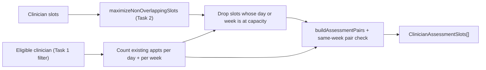

# Task 3: Taking Clinician Capacity Into Account

## Overview

Extend Tasks 1 and 2 so the slots we offer respect each clinician's real-world
capacity: their already-scheduled appointments, their `maxDailyAppointments`,
and their `maxWeeklyAppointments`. A patient should never be offered a slot that
would push a clinician past either cap.

## Goal

Given a clinician's existing `appointments` plus their `maxDailyAppointments` and `maxWeeklyAppointments`, filter the assessment options so that:

- No day is offered where the clinician already has `>= maxDailyAppointments` booked.
- No week is offered where the clinician already has `>= maxWeeklyAppointments` booked.
- Because an assessment books **two** sessions, a pair is only offered if booking *both* still fits within the caps (the subtle case being two sessions that land in the same week, which consumes two weekly slots).

## Scope

- In scope: counting existing appointments per day/week, filtering slots and pairs against the caps, and wiring this into the Task 1 + Task 2 pipeline.
- Builds directly on `getAssessmentSlotsForPatient` (Task 1) and `maximizeNonOverlappingSlots` (Task 2).

## Data flow




## Capacity rules

- **Which appointments count:** only statuses that actually consume a slot. Default = `UPCOMING` and `OCCURRED`; `CANCELLED` and `RE_SCHEDULED` free the slot and are ignored. (`NO_SHOW` / `LATE_CANCELLATION` are past events on past days, which won't be offered anyway.) This set is configurable.
- **Day bucket:** UTC calendar day (epoch ms at `00:00:00.000Z`), reusing the same normalization idea as Task 1.
- **Week bucket:** the UTC Monday of that date's week (ISO-style, Monday-start). Chosen as a clear, conventional boundary; configurable if the business prefers Sunday-start.
- **Single-slot rule:** a slot is bookable only if its day has `< maxDailyAppointments` and its week has `< maxWeeklyAppointments` already booked (room for at least one more).
- **Pair rule:** the two sessions are always on different days, so each day only gains one appointment (covered by the single-slot rule). The only combined effect is when **both sessions fall in the same week** -> that week gains two, so it must have room for two. Different-week pairs are already covered by the single-slot rule.

## Planned implementation

### `src/scheduling/dateKeys.ts` (add `utcWeekKey`)

`utcDayKey` and `MS_PER_DAY` already live here from Task 1. Add the week bucket alongside them so all day/week math stays in one dependency-free module:

```ts
// Canonical week bucket: epoch ms at UTC midnight of that week's Monday.
export function utcWeekKey(date: Date): number {
  const dayMidnight = utcDayKey(date);
  const dayOfWeek = new Date(dayMidnight).getUTCDay(); // 0=Sun .. 6=Sat
  const daysSinceMonday = (dayOfWeek + 6) % 7;
  return dayMidnight - daysSinceMonday * MS_PER_DAY;
}
```

### `src/scheduling/capacity.ts`

```ts
import { Appointment, AppointmentStatus } from "../starter-code/appointment";
import { Clinician } from "../starter-code/clinician";
import { utcDayKey, utcWeekKey } from "./dateKeys";

// Statuses that consume a clinician's capacity. CANCELLED / RE_SCHEDULED free
// the slot, so they don't count toward the caps.
export const CAPACITY_CONSUMING_STATUSES: ReadonlySet<AppointmentStatus> =
  new Set<AppointmentStatus>(["UPCOMING", "OCCURRED"]);

export interface CapacityCounts {
  daily: Map<number, number>; // dayKey -> booked count
  weekly: Map<number, number>; // weekKey -> booked count
}

// Tally a clinician's existing appointments into per-day and per-week counts.
export function buildCapacityCounts(appointments: Appointment[]): CapacityCounts {
  const daily = new Map<number, number>();
  const weekly = new Map<number, number>();

  for (const appointment of appointments) {
    if (!CAPACITY_CONSUMING_STATUSES.has(appointment.status)) continue;
    const dayKey = utcDayKey(appointment.scheduledFor);
    const weekKey = utcWeekKey(appointment.scheduledFor);
    daily.set(dayKey, (daily.get(dayKey) ?? 0) + 1);
    weekly.set(weekKey, (weekly.get(weekKey) ?? 0) + 1);
  }

  return { daily, weekly };
}

// A single session adds 1 to its day and 1 to its week, so both must have room.
export function slotHasCapacity(
  date: Date,
  capacityCounts: CapacityCounts,
  clinician: Clinician,
): boolean {
  const day = utcDayKey(date);
  const week = utcWeekKey(date);
  return (
    (capacityCounts.daily.get(day) ?? 0) < clinician.maxDailyAppointments &&
    (capacityCounts.weekly.get(week) ?? 0) < clinician.maxWeeklyAppointments
  );
}

// Pair sessions are on different days (daily caps handled per-slot). The only
// combined constraint is two sessions in the same week consuming two slots.
export function pairHasCapacity(
  first: Date,
  second: Date,
  capacityCounts: CapacityCounts,
  clinician: Clinician,
): boolean {
  const weekA = utcWeekKey(first);
  const weekB = utcWeekKey(second);
  if (weekA !== weekB) return true;
  return (
    (capacityCounts.weekly.get(weekA) ?? 0) + 2 <=
    clinician.maxWeeklyAppointments
  );
}
```

### Integration with Tasks 1 & 2 (`src/scheduling/assessmentSlots.ts`)

No callbacks or new options on `buildAssessmentPairs` -- it stays a pure Task 1 function. Instead, import the capacity helpers and compose them with `.filter`: drop full-day/week slots before pairing, then drop pairs that can't fit both sessions.

```ts
import {
  buildCapacityCounts,
  pairHasCapacity,
  slotHasCapacity,
} from "./capacity";

export function getAssessmentSlotsForPatient(
  patient: Patient,
  clinicians: Clinician[],
): ClinicianAssessmentSlots[] {
  return clinicians
    .filter((clinician) => isEligibleForAssessment(patient, clinician))
    .map((clinician) => {
      const capacityCounts = buildCapacityCounts(clinician.appointments);

      // Task 3: drop slots on full days/weeks first, then Task 2: drop
      // overlapping slots from what remains.
      const validSlots = clinician.availableSlots.filter((slot) =>
        slotHasCapacity(slot.date, capacityCounts, clinician),
      );
      const bookableSlots = optimizeClinicianSlots(
        validSlots,
        ASSESSMENT_SESSION_MINUTES,
      );

      // Task 1 pairing, then drop pairs that would exceed the weekly cap.
      const pairs = buildAssessmentPairs(bookableSlots).filter((pair) =>
        pairHasCapacity(
          new Date(pair.session1.date),
          new Date(pair.session2.date),
          capacityCounts,
          clinician,
        ),
      );

      return {
        clinician: {
          id: clinician.id,
          firstName: clinician.firstName,
          lastName: clinician.lastName,
        },
        pairs,
      };
    })
    .filter((result) => result.pairs.length > 0);
}
```

## Verification

### `src/scheduling/capacity.test.ts`

```ts
import { buildCapacityCounts } from "./capacity";
import { utcDayKey, utcWeekKey } from "./dateKeys";
import { Appointment } from "../starter-code/appointment";

function appt(scheduledFor: string, status: Appointment["status"]): Appointment {
  return {
    id: scheduledFor,
    patientId: "p",
    clinicianId: "c",
    scheduledFor: new Date(scheduledFor),
    appointmentType: "ASSESSMENT_SESSION_1",
    status,
    createdAt: new Date(),
    updatedAt: new Date(),
  };
}

test("buildCapacityCounts: counts only capacity-consuming statuses, bucketed by day and week", () => {
  const counts = buildCapacityCounts([
    appt("2024-08-19T08:00:00.000Z", "UPCOMING"),
    appt("2024-08-19T10:00:00.000Z", "OCCURRED"),
    appt("2024-08-19T12:00:00.000Z", "CANCELLED"), // ignored
    appt("2024-08-22T09:00:00.000Z", "UPCOMING"),
  ]);

  // Aug 19 has 2 counted; Aug 22 has 1; both fall in the same Mon-Sun week.
  expect(counts.daily.get(utcDayKey(new Date("2024-08-19T00:00:00.000Z")))).toBe(2);
  expect(counts.daily.get(utcDayKey(new Date("2024-08-22T00:00:00.000Z")))).toBe(1);
  expect(counts.weekly.get(utcWeekKey(new Date("2024-08-19T00:00:00.000Z")))).toBe(3);
});

test("utcWeekKey: buckets dates into Monday-start UTC weeks", () => {
  // 2024-08-18 is a Sunday -> belongs to the week of Monday 2024-08-12.
  const sunday = utcWeekKey(new Date("2024-08-18T23:00:00.000Z"));
  const monday = utcWeekKey(new Date("2024-08-12T00:00:00.000Z"));
  expect(sunday).toBe(monday);
});
```

### Add to `src/scheduling/getAssessmentSlotsForPatient.test.ts`

Reusing the `patient` / `slot` / `clinician` helpers from Task 1, add end-to-end tests for the capacity rules:

```ts
import { Appointment } from "../starter-code/appointment";

test("getAssessmentSlotsForPatient: omits a clinician when the only pairable day is at its daily cap", () => {
  const existing: Appointment = {
    id: "a1",
    patientId: "other",
    clinicianId: "c",
    scheduledFor: new Date("2024-08-19T08:00:00.000Z"),
    appointmentType: "ASSESSMENT_SESSION_1",
    status: "UPCOMING",
    createdAt: new Date(),
    updatedAt: new Date(),
  };
  const doc = clinician({
    id: "c",
    maxDailyAppointments: 1,
    appointments: [existing], // Aug 19 is now full
    availableSlots: [
      slot("c", "2024-08-19T12:00:00.000Z"), // removed (day full)
      slot("c", "2024-08-21T12:00:00.000Z"),
    ],
  });

  // Only one day survives, so no valid pair -> the clinician yields no options.
  expect(getAssessmentSlotsForPatient(patient, [doc])).toEqual([]);
});

test("getAssessmentSlotsForPatient: excludes the capped day but still pairs the remaining days", () => {
  const existing: Appointment = {
    id: "a1",
    patientId: "other",
    clinicianId: "c",
    scheduledFor: new Date("2024-08-19T08:00:00.000Z"),
    appointmentType: "ASSESSMENT_SESSION_1",
    status: "UPCOMING",
    createdAt: new Date(),
    updatedAt: new Date(),
  };
  const doc = clinician({
    id: "c",
    maxDailyAppointments: 1,
    appointments: [existing], // Aug 19 is now full
    availableSlots: [
      slot("c", "2024-08-19T12:00:00.000Z"), // removed (day full)
      slot("c", "2024-08-21T12:00:00.000Z"),
      slot("c", "2024-08-22T12:00:00.000Z"),
    ],
  });

  const [result] = getAssessmentSlotsForPatient(patient, [doc]);

  // Aug 19 is dropped, but Aug 21 + Aug 22 still pair.
  expect(result.pairs).toEqual([
    {
      session1: { date: "2024-08-21T12:00:00.000Z", length: 90 },
      session2: { date: "2024-08-22T12:00:00.000Z", length: 90 },
    },
  ]);
});

test("getAssessmentSlotsForPatient: omits same-week pairs that would exceed the weekly cap", () => {
  const doc = clinician({
    id: "c",
    maxWeeklyAppointments: 1, // an assessment needs two openings in one week
    availableSlots: [
      slot("c", "2024-08-19T12:00:00.000Z"),
      slot("c", "2024-08-21T12:00:00.000Z"), // same Mon-Sun week
    ],
  });

  expect(getAssessmentSlotsForPatient(patient, [doc])).toEqual([]);
});
```

